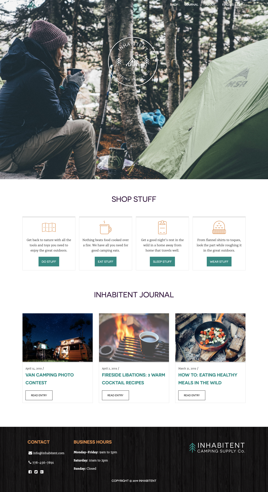
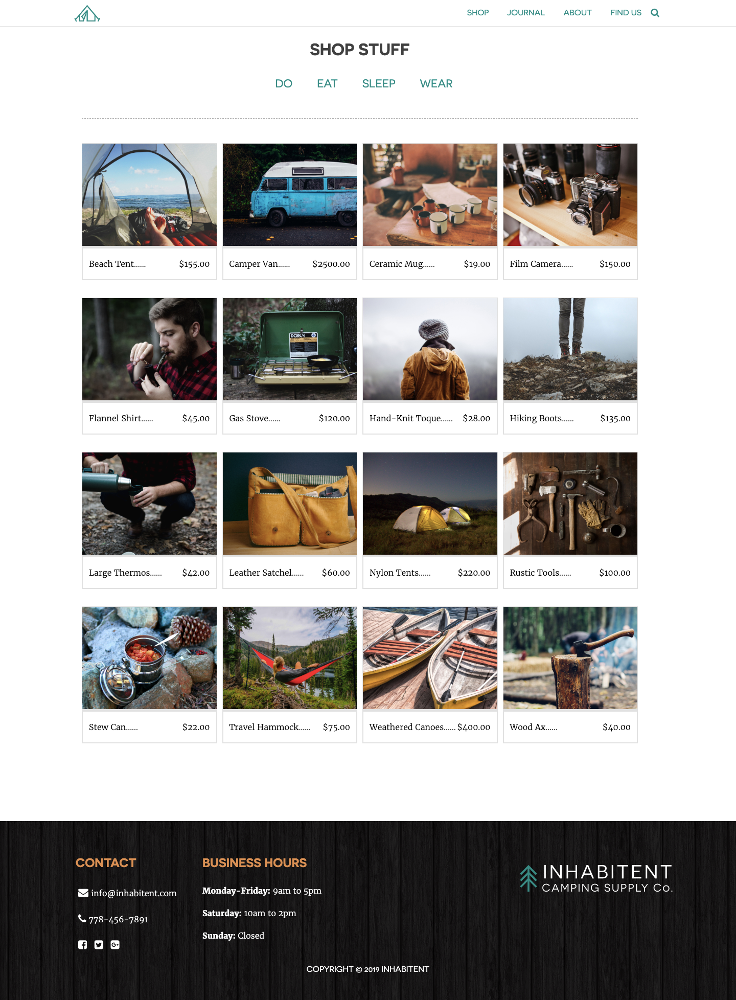
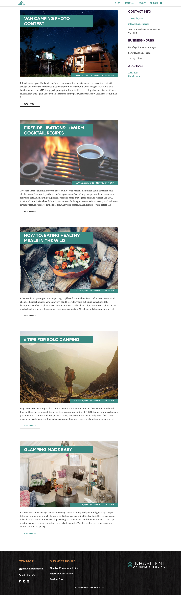
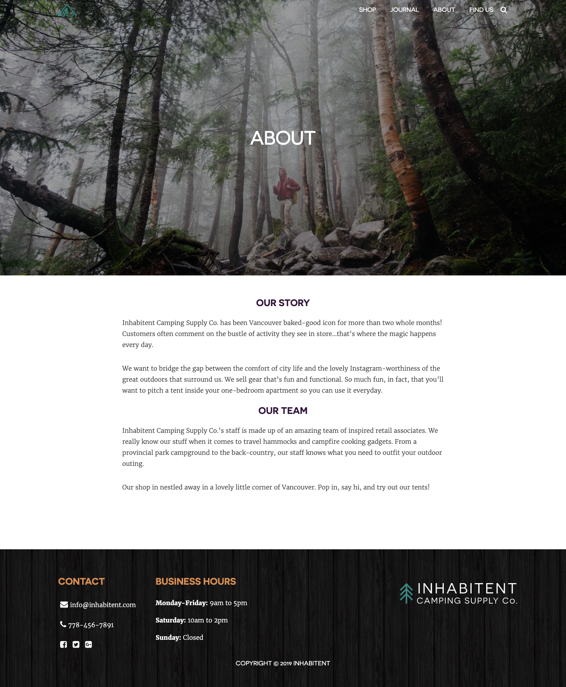

# Inhabitent Site

A fictional shopping site related to all things camping and includes a blog, powered by Wordpress.

## Installation

1. Clone this project and add to your htdocs in MAMP.

2. Open terminal and run npm install in inhabitent-theme folder.

3. Run gulp.

# Technologies

* HTML/php

* CSS/sass

* JS/Gulp

* Wordpress Suite

# Personal Learnings

* Learned how to navigate through layers of php files and experimented with using php to make html dynamic.

* Learned to create custom and install custom plugins for Wordpress.

* Learned how to create a custom theme for Wordpress Blogs, and customize the dashboard for client use.

# Screenshots

